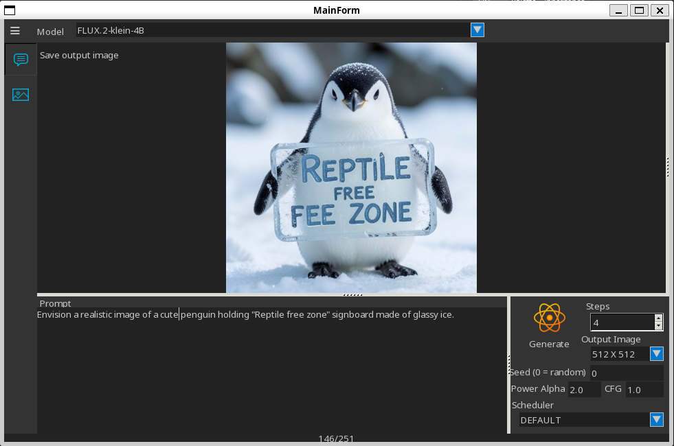
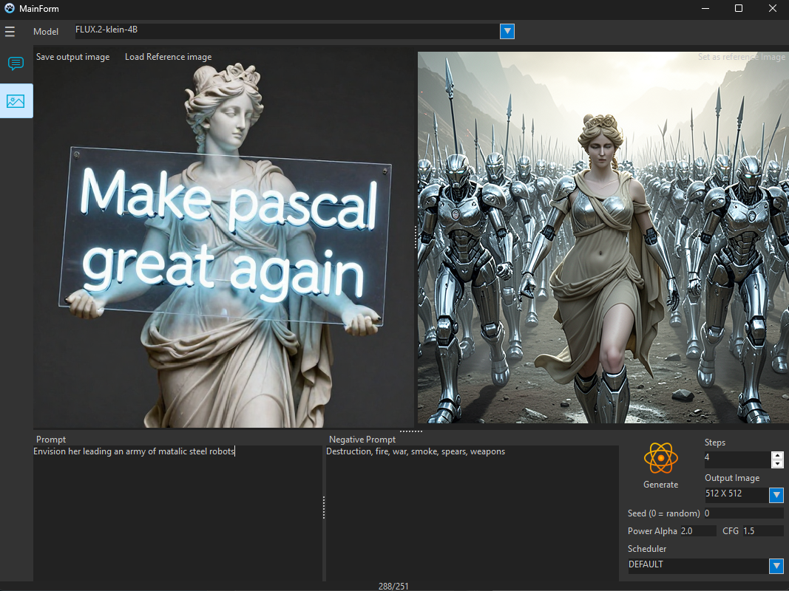
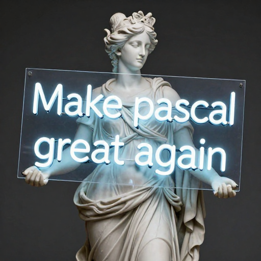
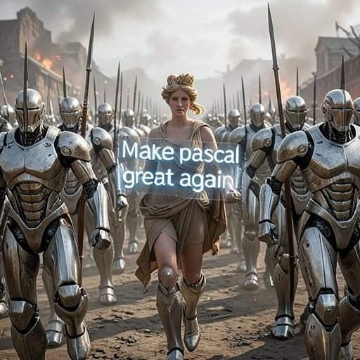

<div align="center">
  
  <h1>Envision</h1>  
  <h3>A Lightweight FLUX2 or ZImage Inference engine<br/>Written in Pure Pascal for (FPC, Lazarus or Delphi)</h3>
</div>


> [!NOTE]
> - Natively parses .Safetensors and .JSON files. 
> - Runs out‑of‑the‑box with no external dependencies.
> - uses lazy loading and Disk Memory Mapping ```mmap()``` significantly saving memory for systems with low RAM.
> - Hand written Intel x86_64 assembly code to squeeze out the best CPU performance possible.
> - **[Windows/Linux]** if OpenBLAS is present on it will automatically bind to it and gain ~20× speed‑up.
> - **[MacOS]** will automatically utilise the [Accelerate Framework](https://developer.apple.com/accelerate/).
> - Image edit support for FLUX2 ( reference image to image, multi ref images to image ) 


## Table of Contents

- [Why pure pascal?](#why-pure-pascal)
- [Supported Models](#supported-models)
- [Installation](#installation)
- [Showcase](#showcase)
- [Work in Progress](#work-in-progress) 
- [Contribution](#contribution)


## Why pure pascal?

- **Zero Runtime** – The binary can be shipped to any machine without requiring a Pascal compiler or DLLs.
- **Safety & Readability** – Pascal’s strong typing and modularity reduce bugs in tensor manipulation.
- **Cross‑Platform** – Works on Windows, Linux, macOS with minimal changes.
- **Concise Executable** - The output executable is self-dependent, less than 4MB (Windows)

---

## Supported Models

*Currently only the following weights are shipped:*

| Model | Model Format | Distilled | Ref img2img | Size |
|-------|------|------|------|------|
| [FLUX2‑Klein-4B](https://huggingface.co/black-forest-labs/FLUX.2-klein-4B) | SafeTensors | :white_check_mark: | :white_check_mark: | ~14 GB |
| [FLUX2‑Klein-9B](https://huggingface.co/black-forest-labs/FLUX.2-klein-9B) | SafeTensors | :white_check_mark: | :white_check_mark: | ~20 GB |
| [FLUX2‑Klein-base-4B](https://huggingface.co/black-forest-labs/FLUX.2-klein-base-4B) | SafeTensors | :x: | :white_check_mark: | ~14 GB |
| [FLUX2‑Klein-base-9B](https://huggingface.co/black-forest-labs/FLUX.2-klein-base-9B) | SafeTensors | :x: | :white_check_mark: | ~20 GB |
| [ZImage‑Turbo-9B](https://huggingface.co/Tongyi-MAI/Z-Image-Turbo) | SafeTensors | :white_check_mark: | :x: | ~40 GB |

## Installation
**Requirement**

Any of the two mainstream object pascal compilers :
- [Lazarus-IDE + FPC 3.2 or above](https://www.lazarus-ide.org/) or
- [Delphi 12 CE or above](https://www.embarcadero.com/products/delphi/starter)

(Optional for Windows and Linux) :
Installing [OpenBLAS](https://www.openmathlib.org/OpenBLAS/) will improve the CPU performance by ~X2 to 3 on x86_64 processors.

OpenBLAS is not required on **MacOS** _(Intel or Silicon)_ since it will automatically use the native **Accelerate** framework.

**Building**

**[Windows / Linux /MacOS]**
Open the provided Project from the Example folder (If using Lazarus I recommend trying EnvisionGUI ) and hit **run** ▶️ *(Debug or Release)*

## Showcase

**Text To Image**


<p align="left"><i>on linux (GTK2)</i><br/></p>

**Image to Image**

<p align="left"><i>Windows</i><br/></p>

| Prompt | Originale Image | Generated Image |
|:-|:-|:-|
| *Make it smile and cartoonish!* |  |  |
| *Make her leading an army of steel robots, <br/>holding the same signboard.* |  |  |

## Work in progress

*(always in in pure pascal)*

- Vulkan support 
- CUDA support
- More models support *(working on [Microsoft Mage](https://github.com/microsoft/Mage) and [Krea2](https://github.com/krea-ai/krea-2) now so stay tuned)*.
- Lightweight MCP Server for AI Agents.
- Further Optimisation
- LoRA Support.
  
## Contribution

Issues and suggestions are welcome.

**Star :star:** this repository if you wish to see it improving.

Pull requests are welcome too, please consider the following guidelines :
- Rely on no external libraries or components, if you have to, make it optional not mandatory.
- Stay with-in the FreePascal/Lazarus/Delphi native units and ensure that the code works the same on both Lazarus and Delphi.
- if you have to use an optional dynamic linked (.so .dll .dylib) library, load it dynamically using ```loadlibrary()```, do not declare functions with ```external```, let the program load them if they were detected in the system.

Donations (This will help improving this further):

<p align="center"><a href="https://www.paypal.com/donate/?hosted_button_id=ANXTNK87HYP4Q"></a></p>

Submit what improvements/features you would like to see in the [issues](https://github.com/hshatti/Envision/issues) section.

Contribution will be acknowledged, generous donations will get your name recognised in the about forms.
